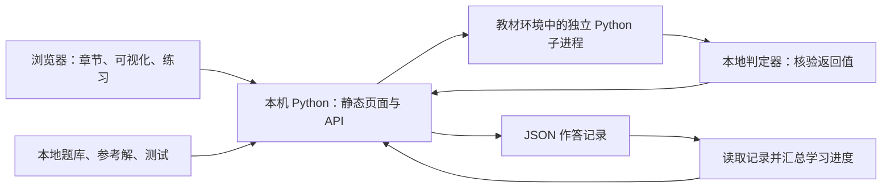

# 交互练习与判题系统设计

设计修订日期：2026-09-18。本文定义全书题型、题目契约、本机运行、文件存储、判题和交付验收；页面结构与视觉交互见[网页设计规范](网页设计规范.md)，课程关系见[教材设计](教材设计.md#assessment-design)，实际交付与验收见 [ROADMAP](../ROADMAP.md)。正式教材和样章使用同一本机作答、Python 子进程判定及 JSON 记录机制，内容与完成身份独立。

题目使用稳定内部 ID，学生界面显示所在篇章与题目标题；描述性 slug 用于直接作答链接。题面、核验材料和参考解分别保存在 `exercises/<篇目录>/questions.json`、`verification.json` 和 `solutions.json`。章内练习路径为 `/chapters/<篇章名>/practice/`，篇末综合沿用篇首页下的独立入口；通过 `/api/session` 建立会话。作答记录位于 `.local/learning/attempts/`，临时工作目录位于 `.work/exercises/`，均不纳入 Git。已退役样章不再提供题目或页面；历史记录仍可读取，但不计入正式进度、不迁移为正式题目答案。当前交付与验收范围见 [ROADMAP](../ROADMAP.md)。

**运行范围：单人在自己的电脑上学习，浏览器作为交互界面；现有本地 Python 程序提供页面与接口，以教材环境中的 Python 子进程执行计算题，使用 JSON 文件保存记录。** 首版不引入 Linux worker、容器、独立数据库或账号系统；也不使用 SQLite。相关接口与存储安排见[本地运行架构](#local-runtime)和[本地文件记录](#local-records)。

## 1. 确定的产品规则

所有小节练习、章末练习和篇末综合任务只有两种形式：

| 类型 | 学习者提交 | 判定与反馈 |
|---|---|---|
| 选择题 `choice` | 单选的一个选项 ID，或多选的选项 ID 集合 | 提交后显示正确/错误、正确选项、逐项解释、必要推导与复习入口；多选必须集合完全一致才正确 |
| 计算题 `python` | 满足题目函数契约的 Python 源代码 | 在本机独立子进程中执行样例和补充测试，显示是否通过、失败类型及可展开的用例差异 |

单选和多选是选择题的两个配置，不增加题型。填空、自然语言问答、报告上传、Notebook 上传、人工评分及 LLM 评分不进入习题系统。手算、推导、模型选择和结果解释用选择题检验；修改模型、算法实现和迁移计算用 Python 题检验。篇末综合任务是共享案例的两类题组成的题组，每道题仍独立判定。

Notebook 保留完整教学、推导、案例演示、题面和本地样例；网页提供统一交互与本地判定。教材依赖和材料准备好后，学习与判题均不需要联网。运行 Notebook 不要求启动网页程序；样例通过仅表示样例通过，只有完整测试通过才更新练习完成状态。主观研究报告可作为教材展示内容，但不再是要求读者提交的习题成果。

## 2. 题库组织与客观化方法

内部稳定题号可使用 `P02-C01-E02`；小节细分时可用 `P02-C01-S02-E01`；篇末题组使用 `P02-FINAL`，其中每题使用独立后缀。内部 ID 不随显示排序变化，题目版本独立递增。学生看到篇章、小节和题目标题，最多辅助显示“第 2 题”，不需要理解维护编码；链接标签写题目名称，URL 用稳定描述性 slug。题目映射到篇、章、小节、目标 T1—T4、数学编号和难度。

| 原练习活动 | 转换后的选择题 | 转换后的 Python 计算题 |
|---|---|---|
| 建立边界与假设、解释曲线 | 从明确候选模型、变量表、图或结论中选择；每个干扰项对应一个常见误解 | 根据给定模型契约计算状态、收支或指标 |
| 手算与推导 | 选择中间步骤、成立条件、正确结果或反例 | 返回推导对应公式在多组输入上的结果 |
| 修改算法或比较实验 | 判断哪项对照能区分两种机制 | 实现更新、估计、控制或评价函数，返回规定结构 |
| 开放迁移 | 给定新场景，选择所有成立的结论或满足条件的方案 | 固定问题和接口，输入换成未见参数、初值或网络，检验泛化计算 |
| 篇末报告与研究复现 | 选择合理的假设、基线、数据划分、消融与适用范围 | 实现案例中的关键步骤及统一评价指标，以独立测试判定 |

每节按需设计 3—5 道题，重难点为 4—5 道。章级大纲的 E1—E3 是出题方向骨架，不是最终题目数量、学生编号或额外题型。E1 侧重概念、E2 侧重实现、E3 侧重迁移；必须各自声明为 `choice` 或 `python`。正式题库交付前，选择题必须补齐完整选项、答案和逐项解析；Python 题必须补齐准确输入输出、参考解、样例、补充测试、判定规则和运行限制。当前篇章大纲是出题设计，不当作已交付完整题库。

篇末题组按“问题与假设 → 数学和算法 → 核验 → 结果解释与适用范围”组织。题间共享只读案例材料；每道代码题都获得完整输入或固定中间结果，不依赖读者上一题的变量或一次错误输出。可以引用同一练习页中的结果，但不能导致后续题无法单独判定。

`tools/course_content.py` 发现各篇的 `catalog.json` 与题库，拒绝重复身份或缺失核验材料；样章目录可独立移除。正式题目用独立的稳定描述性 ID，复制题目不能继承样章记录。`/api/v1/progress` 以 `course` 为汇总范围返回当前版本有效尝试 `started` 与完整通过 `passed`，界面严格按当前篇/章/小节题目集合计算进度，篇末题组也计入本篇。系统错误、取消、中断、未保存和旧版本不进入有效尝试集合。无题目保持未开始。正式草稿按章保存，既有样章草稿键保留。状态颜色、代码键盘行为与限高示例展示统一见[网页规范](网页设计规范.md)。

## 3. 题面与核验材料契约

| 层 | 必备字段 | 读取方 |
|---|---|---|
| 公共元数据 | `id`、`version`、`type`、`part_id`、`chapter_id`、`lesson_id`、`objectives`、`title`、`difficulty`、`required` | 页面、Notebook 索引和 API |
| 题面 | `statement`、假设、变量单位、先修/复习链接、数据文件及校验值 | 学习者 |
| 选择题输入字段 | `selection_mode`、带稳定 ID 的选项、允许选择数量约定 | 学习者；提交前不在答题界面显示答案或解析 |
| 选择题核验材料 | 正确 ID 集合、每项解析、总体解释、所对应误解 | 本地判定器；提交后返回完整教学反馈 |
| Python 输入字段 | `entrypoint`、`parameters`、`returns`、`constraints`、`starter_code`、样例输入输出及解释、允许库、运行环境与限制、误差规则 | 学习者 |
| Python 核验材料 | 参考实现、固定样例与补充测试、期望输出、判定器、测试类别、错误解回归集 | 本地判定器与题库维护者 |
| 版本身份 | 题目版本、题面与测试集摘要、判定器版本、实际 Python 和相关依赖版本 | 提交记录及复现检查 |

题库由 JSON/Markdown 题面、参考解及 Python 测试文件组成，随教材一起版本管理和保存在本机。题面 API 按字段返回作答所需内容，答案与补充测试不在首次打开题面时自动展开；这是教学展示顺序，不是保密或防作弊机制。本机使用者可以查看全部文件，因此不再使用“私有制品”或“隐藏答案不可读取”的承诺。观测、拟合输入与核验答案仍分别组织，避免教学计算中的数据泄漏。

Markdown、公式和输出在渲染前清理，提交源码和运行日志按文本显示，不执行其中的 HTML/JavaScript。补充测试用于检查未出现在样例中的边界、参数和结构；提交后允许展开失败用例复盘。

函数名统一为 `solve`，**参数逐题具名定义**，例如 `def solve(A0: float, durations: list[float], inflows: list[float], outflows: list[float]) -> list[float]`。参数表列出名称、类型、单位及含义；返回值说明类型、长度、是否含起点及多项结果的顺序。禁止用 `payload`、通用 `data`、`*args` 或 `**kwargs` 掩盖接口。单个物质量列表直接作为列表返回；多个结果可返回有明确顺序的元组。读者可以写辅助函数，无需读取命令行、解析 JSON 或组装通信对象。

后台用 JSON 保存参数映射，独立进程按 `solve(**arguments)` 把映射展开为题面中的逐个参数；这是执行器内部实现，学生模板始终使用明确参数。返回值经 JSON 序列化后核验，元组在通信中表示为数组，判定检查长度、顺序和数值。数值必须有限，大小/深度/元素数量受限，不使用 pickle 或任意对象反序列化。

题面按任务、函数签名、参数说明、返回值、计算规则、约束、样例及解释组织。结构参考 [LeetCode Two Sum](https://leetcode.com/problems/two-sum/description/) 对已知量、所求、输入、输出、解释和约束的明确分工；本教材另外说明模型、单位及数值误差。参考页面用于组织方式，不复用其题目正文。

样例分为“输入样例”和“输出样例”，每侧同时生成说明表格与 Python 代码。输入代码逐个给参数赋值并直接调用函数，如 `solve(A0, durations, inflows, outflows)`；输出代码定义 `expected_output`，展示实际返回类型、顺序和原始精度数值，再给出样例解释。表格可标近似值，代码不得用已舍入的字符串反推数值。两者从同一个 `samples` 条目生成并同步至 Notebook；复制不改写草稿。验收实际运行具名参数调用，不得在参考解中增加字典适配器来掩盖旧接口。

### 3.1 完整选择题示例

题号 `P01-C02-E01`，多选：物质量 A 的单位为 U，流率 u 的单位为 U/T，时间间隔 h 的单位为 T。选择所有正确说法。

| 选项 | 内容 | 提交后显示的解析 |
|---|---|---|
| A | 在流率恒定时，hu 是该时段流入的物质量 | 正确：U/T × T = U，且恒定流率假设已给出 |
| B | 可以将 A 与 u 直接相加得到新物质量 | 错误：两者量纲不同，需要乘时间并计入全部流出 |
| C | 相同流率持续两倍时间，累计流入为原来的两倍 | 正确：在题设的恒定流率下，累计量与时长成正比 |
| D | 相同存量必然对应相同流入速率 | 错误：存量描述当前数量，输入可以由不同外部条件决定 |

正确集合为 `{A, C}`。漏选、多选和选错都显示“未通过”，并保留学习者选项与全部解析。不采用负分或部分分。修改选项后进入“已修改，待重新提交”，上次判定仍绑定上次答案。

### 3.2 完整 Python 题示例

题号 `P01-C02-E02`：给定起点物质量 `A0`（U）、时长列表 `durations`（T）、流入列表 `inflows` 与流出列表 `outflows`（U/T），依次计算每段结束时的物质量，直接返回包含起点的 `amounts` 列表。

约束：0—100 个时段；时长为正；输入为有限数；题目保证精确收支下物质量非负；不允许额外裁剪；输出长度必须为时段数加一。每个结果按 `abs(actual − expected) <= 1e-10 + 1e-10 * abs(expected)` 判定，形状单独严格核验。

```python
def solve(A0: float, durations: list[float],
          inflows: list[float], outflows: list[float]) -> list[float]:
    # 返回包含起点与各段终点的物质量列表。
    raise NotImplementedError
```

**输入样例**

| 参数 | 含义 | 本组数值 | 单位 |
|---|---|---|---|
| `A0` | 起点物质量 | 5.0 | U |
| `durations` | 两段的时长 | [1.0, 2.0] | T |
| `inflows` | 两段的流入速率 | [3.0, 3.0] | U/T |
| `outflows` | 两段的流出速率 | [1.0, 1.0] | U/T |

```python
A0 = 5.0
durations = [1.0, 2.0]
inflows = [3.0, 3.0]
outflows = [1.0, 1.0]
result = solve(A0, durations, inflows, outflows)
```

**输出样例**

| 位置 | 返回物质量 / U |
|---|---|
| 起点 | 5.0 |
| 第一段末 | 7.0 |
| 第二段末 | 11.0 |

```python
expected_output = [5.0, 7.0, 11.0]
```

**解释**：两段分别增加 1×(3−1)=2 U 和 2×(3−1)=4 U，所以从 5 U 依次增加到 7 U 与 11 U。返回值包含起点，共三项。

公开样例覆盖正常输入和空时段；补充测试覆盖不等时段、零流量、恰好清空、大/小量级与多个时段。参考解用独立累计收支核对，不只复用学生模板逻辑。测试须拒绝漏乘时长、漏返回初值、只返回末值、固定样例输出等错误实现。

## 4. 判定规则与结果语义

| 任务 | 判定方法 | 禁止的误用 |
|---|---|---|
| 整数、布尔、类别与索引 | 明确类型、形状和精确值；无序集合须题面预先声明 | 默认把列表顺序忽略，或把任意真值当布尔正确 |
| 浮点、向量、矩阵 | 先验维数、有限性，再按题设绝对/相对容差或指定范数比较 | 用同一容差覆盖所有量纲，默认接受 NaN/Inf，或把模型误差当浮点误差 |
| 数值算法 | 指定离散模型的结果、独立解析值、收敛或守恒等多个检查联合使用 | 只查一个不变量便认为算法正确；用精确解拒绝符合题意的近似算法 |
| 多解优化与控制 | 检查可行性、目标值界限、最优性残差与维数，必要时容许等价解 | 只与某一条控制序列逐元素相等才通过 |
| 随机算法 | 优先以具名参数提供固定随机输入；需要抽样时明确 RNG、种子列表与重复次数，按预先校准的矩/分位/误差条件判定 | 每次提交重新抽无记录的测试并随机判错；对合法不同实现强求逐点同轨迹 |
| 学习与研究方法 | 判关键算法、固定小数据的预测/残差/约束或评估函数，使用已校准阈值 | 以训练损失单一阈值判正确，要求一次提交完成无界搜索、长时间训练或主观论文评审 |

每个统计判定器用多份正确实现和有意构造的错误实现校准误接受/误拒绝风险；随机测试集固定到题目版本，可复现重判。无法形成稳定客观判据的内容改为给定结果的选择题或拆成更小的计算题，不能临时引入人工或 LLM 裁决。

“用示例试算”和“提交判定”共用同一个本地执行器，前者只跑样例且不计通过进度，后者运行样例与补充测试。结果在代码区上方展开，先显示判定摘要、通过数和失败类型，再提供首个失败用例的输入、期望、实际值、差异和截断日志；补充用例详情默认折叠，可主动展开。Python 语法错误及运行异常返回 traceback，保留源码、行号、Python 提供的指示箭头、学习者调用链及异常因果链。页面提供复制和出错行定位，草稿改变后停用旧行号定位；内部程序故障单独说明。

异常结果的 `result` 保留 `message`、`line`，并增加可选的 `column`（从 1 开始）与 `traceback` 文本；它们与同一记录的 `source` 快照一同保存。执行器以 `answer.py` 编译并注册源码，去掉执行器自身的包装帧，不抓取局部变量；第三方库帧和学习者异常保留。超长 traceback 保留开头和末尾，并明确标注中间截断（约 20,000 字符）。旧记录缺少新字段时仍显示原错误说明；超时、取消、不可编码返回值和系统故障没有可用 Python 调用链时，不生成虚假的 traceback。

| 终态代码 | 页面文案 | 归因 |
|---|---|---|
| `AC` | 全部测试通过 | 所有必要测试通过；不表示真实世界普遍正确 |
| `WA` | 结果不符合要求 | 数值、结构、约束或统计条件不符合题设 |
| `CE` | Python 语法错误 | 语法检查在执行子进程内完成 |
| `RE` | 运行出错 | 代码异常、缺少入口或返回不可编码数据 |
| `TLE` / `OLE` | 超过时间 / 输出限制 | 超过题目公布并实际实施的限制；首版不报告未经实现的内存硬限额结果 |
| `CANCELLED` | 已取消 | 本地程序已终止并回收本次执行进程，不计作错误 |
| `INTERRUPTED` | 执行中断，请重新提交 | 上次程序异常退出留下未完成任务；不计作错误，不自动重跑代码 |
| `SYSTEM_ERROR` | 本地判题未完成 | 环境缺失、内部判定或记录保存失败；不计作学习错误，提供具体恢复提示 |

只以完整判定的 `AC` 或正确选项集合更新通过状态。进度从已保存的作答记录汇总“本版本曾通过”“最近一次结果”“是否已展示解析/核验详情”，不把展示反馈后的通过描述为无辅助掌握，也不把“已展示”当成确实阅读。题目实质改版保留旧版本记录，新版显示“待重新完成”，不偷偷覆盖原结果。

## 5. 本地运行与文件存储

<a id="local-runtime"></a>
### 5.1 一个本机入口

沿用 [tools/serve.py](../tools/serve.py) 和 README 已验证的启动方式，扩展当前绑定 `127.0.0.1` 的本地程序。页面、题库接口、选择题判定与代码执行协调由同一 Python 程序提供；计算代码另起短时子进程。前端继续使用 HTML/CSS/ES Modules，接口采用现有标准库 HTTP 服务的路由扩展，不为首版增加独立 Web 框架或前端构建步骤。



首版面向本人电脑上的单人学习；多个浏览器标签页共享同一组文件记录。同一记录目录只允许一个本地程序实例写入，启动时获取目录独占锁，第二个实例提示已有程序运行。程序只监听回环地址，不设计局域网或公共托管入口。Notebook 可独立运行，可视化计算按教学需要继续在浏览器中完成。

页面服务沿用文件访问白名单；学习记录、执行临时目录和程序配置不通过静态目录公开。请求校验 Host，修改请求校验同源 Origin 与每次启动生成的随机请求令牌；同源引导接口提供令牌，页面仅在内存中持有。GET 请求不执行提交代码，不启用跨域访问，不接受任意系统命令或客户端指定的解释器路径。这些是本地接口的访问约束，不是学习账号或安全沙箱。

<a id="local-api"></a>
### 5.2 本地 API

所有接口位于本机页面的同一来源。没有注册、登录、匿名身份、会话续期或跨设备同步。

| 接口 | 请求与响应 |
|---|---|
| `GET /api/v1/health` | 本地程序状态、实际 Python 环境和当前计算任务；提供恢复连接时需要的启动信息 |
| `GET /api/v1/bootstrap` | 本次启动的请求令牌；仅供同源页面初始化，响应不缓存 |
| `GET /api/v1/catalog` | 篇章、目标、Notebook 导航、题目清单与当前版本 |
| `GET /api/v1/exercises/{id}?version=...` | 题面、选项或函数契约、样例、运行限制；首次展示不含答案与补充用例详情 |
| `POST /api/v1/choice-attempts` | 题号、版本、选项 ID 集合和请求 ID；保存记录后同步返回判定与逐项解析 |
| `POST /api/v1/submissions` | 题号、版本、源码、请求 ID、`mode=samples/full`；接受后返回 `202` 与提交 ID |
| `GET /api/v1/submissions/{id}` | 代码提交的状态、对应快照、版本、用例结果、日志与耗时 |
| `POST /api/v1/submissions/{id}/cancel` | 幂等取消；已结束则返回既有终态，运行中则等待进程回收后确认取消 |
| `GET /api/v1/progress?part=...` | 从本地记录汇总当前版本的篇、章、题组与题目进度 |

计算任务固定一个执行槽，不设等待队列；运行期间仍可阅读、编辑和提交选择题。另一计算请求收到 `409 BUSY`，包含当前任务 ID，可等待或主动取消当前任务后重新提交。

提交绑定 `exercise_id`、`exercise_version`、`source` 或选项、`mode` 和 `request_id`。同请求 ID、同内容返回已有记录，不重复执行；同 ID 不同内容返回 `409 REQUEST_CONFLICT`。题目版本失效返回 `409 VERSION_CONFLICT`，非法输入返回 `422`；前端保留草稿。题目目录决定测试集、解释器和限制，客户端不能覆盖。

状态查询每秒一次，页面不可见时放慢到每五秒一次，终态后停止。刷新或请求中断后先查询原请求，不盲目重建任务；本地程序重启后重新取得请求令牌，再恢复查询。首版不引入 WebSocket。

<a id="local-execution"></a>
### 5.3 Python 执行与限制

- 使用启动本地程序的 `sys.executable`，复用教材虚拟环境。按参数列表且 `shell=False` 启动执行器，不拼接 shell 命令，不在页面进程中 `exec` 提交代码，也不占用 Jupyter 内核。[Python subprocess 文档](https://docs.python.org/3/library/subprocess.html)
- 每次样例运行或完整提交创建一个新子进程和独立临时工作目录，执行结束回收；各测试用例提供完整输入，题目与解答不得依赖前一题或前次提交的变量。
- 首版题目采用单进程计算。输入与返回值使用受限 JSON，运行日志与结构化返回值分开收集；判定器在执行子进程之外核验结果，不采信提交代码自行给出的 `AC`。
- 运行前检查题目所需库及其版本范围，缺失时明确提示环境问题；提交期间不自动安装或下载依赖。数值库线程默认设为 1，并在实际环境验证。
- 独立子进程分离运行状态，但代码仍拥有本机用户权限；首版不承诺限制任意文件访问、网络访问或恶意创建其他进程，不将其称作安全沙箱。执行器只支持题目约定的单进程计算。
- 超时、输出超限或取消时，终止并等待本次受管理子进程退出，回收管道和临时目录后释放执行槽；正常停止本地程序时采用相同清理路径。基础设施的失败与答题错误分开记录。

| 项目 | 首版默认值与约定 |
|---|---|
| 运行环境 | 教材本机 Python；以当前已验证的 Windows / Python 3.13 为首个验收环境，其他平台分别验证 |
| 并行任务 | 同时 1 个计算任务，无等待队列；选择题判定不占用计算槽 |
| 墙钟时间 | 每次任务默认 30 s，包含解释器启动和导入；特殊题在版本中显式设置，最高 120 s |
| 源码 | UTF-8，最多 64 KiB |
| 测试输入 | 每组参数序列化后最多 1 MiB，嵌套不超过 16 层，容器内元素合计不超过 100,000；题目可以更严格 |
| 结构化输出 | 每个任务合计最多 1 MiB，遵守同样的深度与元素上限；不接受 NaN/Inf，除非题面明确给出替代编码 |
| 日志 | stdout/stderr 合计最多 256 KiB；持续读取并计数，超限终止，不先无限缓存再截断 |
| CPU 与内存 | 首版不宣称实现硬限额，不展示虚构的精确内存峰值或 `MLE` 判定 |
| 临时文件 | 使用程序创建的本次任务目录；教学数据通过题目声明读取，工作目录不是权限隔离边界 |

时间预算须在多份正确解上实测，再固定到题目版本；界面说明是本机墙钟限制，不将不同电脑的运行速度当作算法排名。M12/M13 的长训练和大搜索保留在 Notebook 演示，网页判定有限子问题。超时异常本身不等于已结束子进程，管道也不能无限缓存；实现和验收必须覆盖清理与输出上限。[Python 超时与输出处理](https://docs.python.org/3/library/subprocess.html#subprocess.Popen.communicate)

<a id="local-records"></a>
### 5.4 JSON 文件记录与进度

以下为待实现的目录约定；首版不创建数据库，也不维护独立的进度真值文件。

```text
exercises/                         # 题面、参考解与测试，随教材版本管理
.local/learning/attempts/<id>.json  # 每次作答一个记录文件
.work/exercises/<id>/              # 本次执行的临时工作目录
浏览器 localStorage                # 尚未提交的代码草稿
```

`exercises/` 的具体题目材料随相应篇章交付；本机运行产生的 `.local/` 在实现时加入 Git 忽略规则，现有 `.work/` 已忽略。记录由本地 Python 统一读写；路径只从程序生成的记录 ID 派生，浏览器不能指定读写位置。

每份作答记录包含 `schema_version`、记录/请求 ID、创建及结束时间、题号与版本、题型、模式、选项或源码快照、状态与结果、题目/测试/判定器摘要、实际 Python 与相关依赖版本。选择题标记已返回解析，代码题标记已提供哪些核验反馈。代码直接放在对应 JSON 记录中，避免代码与结果文件错配。

| 对象 | 规则 |
|---|---|
| 题库 | JSON/Markdown 组织题面，Python 文件组织参考解和测试；题面与核验材料分别读取 |
| 作答记录 | 一次提交一个 JSON；运行中更新同一记录，终态后保留，重新提交产生新记录 |
| 学习进度 | 从已完成并保存的记录汇总；样例运行不计入，通过状态按题号和版本区分 |
| 草稿 | 浏览器按当前站点来源、题号和版本保存；切换端口/浏览器或清除浏览器数据后不保证保留，提供下载代码入口 |
| 备份与迁移 | 停止本地程序后复制 `.local/learning/`；保留对应版本的教材与依赖信息，不依赖远程账户 |
| 历史 | 不自动按天清理源码和记录；旧版通过保留，环境升级不自动重判或覆盖历史 |

本地程序用写入锁串行完成文件更新；先将完整 UTF-8 JSON 写入同目录临时文件，刷新并关闭后替换目标文件。进度仅从正式记录文件计算，残留临时文件不参与汇总；一条提交只需更新一个记录文件，避免多文件状态不一致。记录读取、备份和替换路径不得扩展为任意文件管理接口。

任务状态为 `PREPARING -> RUNNING -> JUDGING -> FINISHED(verdict)`；取消请求进入 `CANCELLING`，实际回收后以 `CANCELLED` 结束。页面关闭不自动取消运行。重新启动程序时，未结束的记录标为 `INTERRUPTED`，不计错、不自动重跑；异常退出的记录不是进程已清理的证明，不凭旧 PID 自动终止不明进程。

重复请求通过记录中的请求 ID 与内容摘要识别；结果落盘后才更新持久进度。保存失败时显示“结果未保存”及恢复提示，不虚报已完成。无法解析的记录保持原文件并报告，相关进度标记为不完整；不静默删除、覆盖或把损坏记录当成从未作答。

## 6. 实施顺序与验收

不额外增加与篇章并列的新里程碑。M1 修订已实现当前 22 题的作答链路，后续篇按需扩展，具体状态只在 ROADMAP 维护：

1. **M2**：复用 M1 两类题、单任务子进程和 JSON 记录，将统一篇/章页面和目标映射用于正式教材，覆盖第 1 篇必做题与篇末题组，并应用白底界面与独立图表色板。
2. **M3—M5**：完成正式章节独立编写（样章可复制改编），扩展浮点、ODE、矩阵、收敛及性质判定，统一反馈和复习链接。
3. **M6—M9**：固定随机评估契约、数据划分、估计与多解优化/约束判定，验证随机误判和本机计算成本。
4. **M10—M13**：增加图、空间模型和有限研究题；复用相同页面、本地接口、文件记录及题目交付流程。

| 验收维度 | 必须通过的检查 |
|---|---|
| 题目质量 | 选项无歧义且逐项解析正确；参考解通过、常见错误解被拒绝；提交类型只有选择题与 Python 计算题 |
| 数学判定 | 维数、单位、误差、随机设置、多解等价性和边界规则明确；同一代码、测试和环境可复现 |
| 本地运行 | 在已验证的 Windows 教材环境启动一个程序后可完成两类题；准备好依赖与材料后断开互联网仍可使用 |
| 交互 | 重复点击、多标签页、刷新、题目换版、修改草稿和取消不会串题或错记进度；计算槽忙碌时明确反馈 |
| 执行稳定性 | 检查死循环、语法/运行异常、过量输出、超时与取消；受管理进程回收后下一题可运行；不宣称安全沙箱或未实现的内存限额 |
| 文件记录 | 重启后历史可读、未完成任务标为中断；临时文件不计进度，损坏记录明确报告，写入失败不伪造已保存状态 |
| 页面与接口 | 题面和结果按文本安全渲染，接口只接受本机同源操作，记录目录不通过静态服务公开 |
| 一致性 | 页面、Notebook 和题库 ID/版本一致；样例与完整判定、教学答案分离与保密机制的区别明确；未实现能力不标为完成 |

上述为本项目已确定的本地设计；引用资料用于核查标准库机制，文档更新不表示页面、判题或记录功能已实现或验收。
